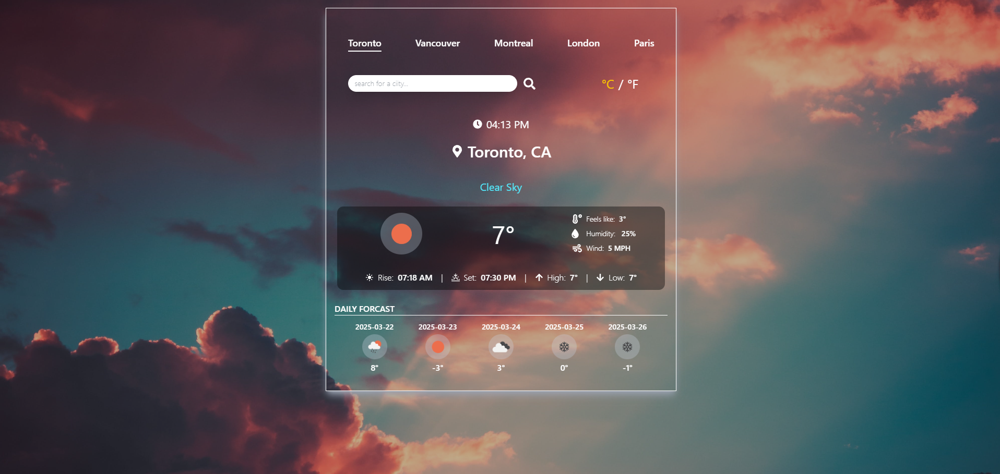

# Weather App

## Introduction

This is a simple React app that uses the [OpenWeatherMap API](https://openweathermap.org/api) to display the current weather for a given city. It also displays a 5-day forecast for the city. This React app is utilizing Tailwind CSS for styling.

## Features

- 🌍 Search for weather information by city name
- 🧭 Quick access to major city weather with one click
- 🌡️ Toggle between metric (°C) and imperial (°F) units
- 🔎 View detailed current weather conditions:
- - Current temperature
- - "Feels like" temperature
- - Wind speed
- - Humidity
- - Sunrise and sunset times
- - Daily high and low temperatures

- 📅 5-day weather forecast
- 📱 Fully responsive design for all devices
